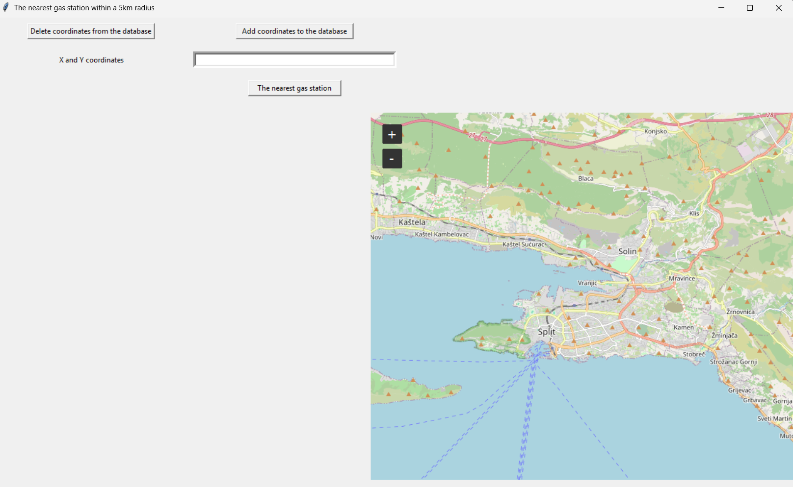

# Gas-Station-Finder

A desktop GIS application built with Python that allows users to input their location and find the nearest gas stations within a 5 km radius using spatial queries in PostgreSQL/PostGIS. The app features an interactive map, database integration, and a user-friendly GUI.




## Features

- Input coordinates and store them in a PostgreSQL/PostGIS database
- Perform spatial queries using `ST_DWithin` to find nearby gas stations
- Display results in the GUI and optionally on the map
- Add and remove user location points
- Interactive map with left and right click events
- Marker placement and visualization using `tkintermapview`
- Real-time integration between Python GUI and spatial database

## Technologies Used

- **Python 3**
- **Tkinter** – GUI framework
- **tkintermapview** – Map widget for Tkinter
- **PostgreSQL** – Relational database
- **PostGIS** – Spatial extension for PostgreSQL
- **psycopg2** – PostgreSQL adapter for Python

## Spatial Database Logic
### This project demonstrates practical use of PostGIS for geospatial analysis:
- Coordinates are stored as POINT geometries with SRID 4326
- Spatial proximity is calculated using ST_DWithin with geography casting for accurate distance in meters
- Queries are optimized for performance and accuracy using spatial indexing and proper SRID handling
#### Example query used in the app:
```
SELECT naziv, adresa
FROM test
WHERE ST_DWithin(points::geography, (SELECT points FROM tocka WHERE id = 1)::geography, 5000);
```

## Installation

1. Clone the repository:
   ```bash
   git clone https://github.com/ivan-marusic/Nearest-Gas-Station-FINDER.git
   cd Nearest-Gas-Station-FINDER
   ```
2. Install required Python packages:
   `pip install tkintermapview psycopg2`
Ensure you have PostgreSQL and PostGIS installed and configured. Create the necessary tables (test, tocka) and populate them with spatial data.

## Usage

1. Launch the application.
2. Enter coordinates manually or click on the map to add a marker.
3. Save the location to the database.
4. Click "Nearest gas station" to perform a spatial query.
5. View results in the GUI and on the map.
